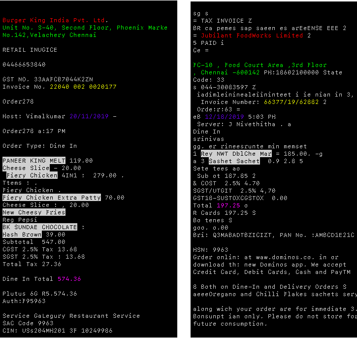

# Key Information Extraction as *Character-wise Classification with LSTM*

## Introduction
A method for key information extraction problem as a character-wise classification problem with a simple stacked bidirectional LSTM. The method first formats the text from an image into a single sequence using Tesseract OCR. The sequence is then fed into a two-layer bidirectional LSTM to produce a classification label from 7 classes - 6 key information category and one "others" - for each character. The method is simple enough with just a two-layer bidirectional LSTM implemented in PyTorch, and proves to sufficient in understanding the context of a receipt text and outputting highly accurate results.

## Dependency

- PyTorch 
- regex
- numpy
- colorama
- cv2
- tesseract

## Training

Training data is available at `./new_data.pth`<br/>
<br/>*For training* of the model, please refer to [this Google Colab file](https://colab.research.google.com/drive/1RVVXHy7KRPt2qMrqCrnIIewe1b6I268T)
<br/><br/>
To *test* the model:

```shell
$ python ./src/test.py
```
NOTE: Still under development, please use the Web Interface for checking the results.

## Approach

- **Task 1 - Scanned Receipt OCR**: Tesseract OCR
- **Task 2 - Key Information Extraction**: Character-wise classification with Bi-LSTM

For the information extraction task, each image in the dataset is annotated with a text file with format shown below:
```json
{
  "company": "STARBUCKS STORE #10208",
  "address": "11302 EUCLID AVENUE, CLEVELAND, OH (216) 229-0749",
  "date": "14/03/2015",
  "invoice id":"5628391",
  "total": "4.95", 
  "items": "WhiteMochaV"
}
```

## Results

Run ` $ python test.py`. A prompt will ask for path to input image.<br/>
The image is read using *OpenCV* and passed to *Tesseract* for OCR using *pytesseract library*. Once the text is extracted out of the image, it is passed as a sequence to the bi-LSTM model, which gives a classification at character level with prediction of classes along with probability values.<br/>
Based on the output of the LSTM, the postprocessing algorithm converts the character level output into a JSON format with 6 key information.

The visualisation shows different entities that were extracted out of a bill image by colour coding.




## Execution

```
$ python3 test.py
>> Enter path to image:3.jpg 
```
