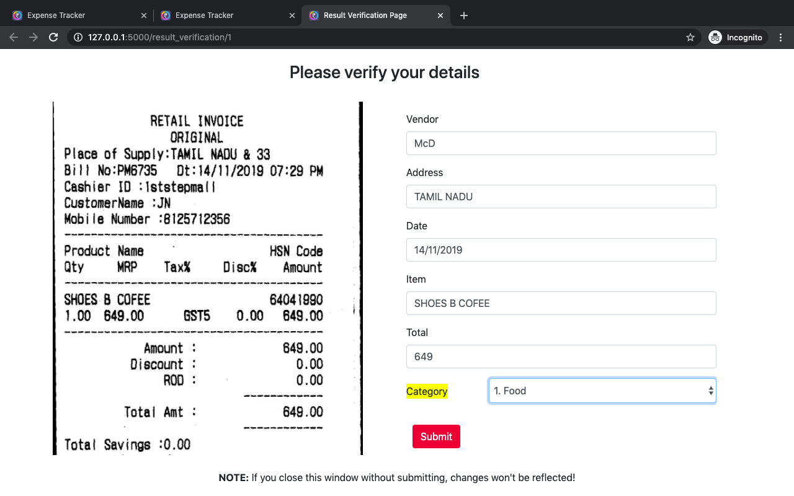

# Unifynd Hackathon
Team Name: **GroupTwo**<br/>
Team Leader: Shubham Bisht

## **Problem Statement 2:** <br/>
**Key Information Extraction from Scanned Receipts**: The aim of this task is to extract texts of a number of key fields from given receipts, and save the texts for each receipt image in a `json` file.
<br/><br/>
&nbsp;  &nbsp;  **Step 1:** Extracting all the text from given Invoice Image. (Text Region Detection, OCR) <br/>
&nbsp;  &nbsp;  **Step 2:** Recognising Key information from the text like Store Name, Address, Total Amount etc using **Bi-directional LSTM based approach**

## Usage Guide

This repository contains three directories. Inside each folder there are documentations of the method we adopted and guide of usage.

- **Folder 1 - Bill Label Tool**: A GUI tool for efficiently labelling various entities in huge dataset of invoice images. 
- **Folder 2 - ML**: Bi-LSTM Approach for Character-wise classification of invoice text into key entities.
- **Folder 3 - Web UI**: A user interface for uploading Invoices and receiving results in a HTML form
<br/>

- **Folder 4 - Android UI**: Android interface for uploading Invoices, receiving results and to watch previous Bill uploads. [Find the Android Repo here](https://www.google.com)

## Approach

- **Task 1 - Scanned Receipt OCR**: Tesseract OCR
- **Task 2 - Key Information Extraction**: Character-wise classification with Bi-LSTM

For the information extraction task, each image in the dataset is annotated with a text file with format shown below:
```json
{
  "company": "STARBUCKS STORE #10208",
  "address": "11302 EUCLID AVENUE, CLEVELAND, OH (216) 229-0749",
  "date": "14/03/2015",
  "invoice id":"5628391",
  "total": "4.95", 
  "items": "WhiteMochaV"
}
```

## Results


